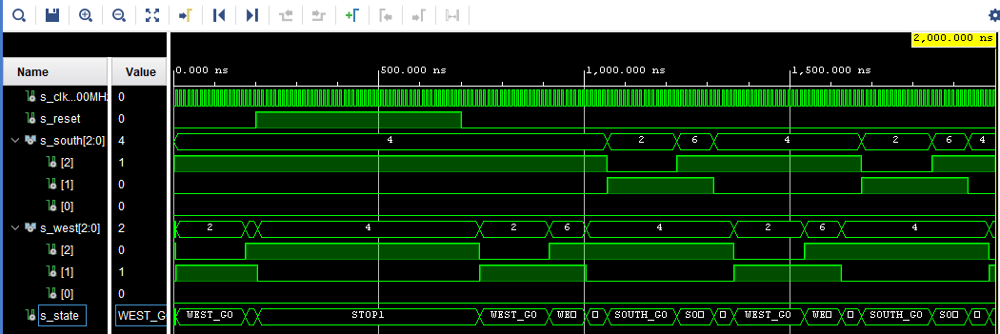

# Lab 8: Radim Macho

### Preparation tasks

1. See schematic or reference manual of the Nexys A7 board and find out the connection of two RGB LEDs, ie to which FPGA pins are connected and how. How you can control them to get red, yellow, or green colors? Draw the schematic with RGB LEDs.

| **RGB LED** | **Artix-7 pin names** |**Red** | **Yellow** | **Green** |
| :-: | :-: | :-: | :-: | :-: |
| LD16 | N15, M16, R12 | 1,0,0 | 1,1,0 | 0,1,0 |
| LD17 | N16, R11, G14 | 1,0,0 | 1,1,0 | 0,1,0 |

2. See schematic or reference manual of the Nexys A7 board and find out to which FPGA pins Pmod ports JA, JB, JC, and JD are connected.

| **Pmod JA** | **Pmod JB** |**Pmod JC** | **Pmod JD** |
| :-: | :-: | :-: | :-: |
| JA1: C17 | JB1: D14 | JC1: K1 | JD1: H4 |
| JA2: D18 | JB2: F16 | JC2: F6 | JD2: H1 |
| JA3: E18 | JB3: G16 | JC3: J2 | JD3: G1 |
| JA4: G17 | JB4: H14 | JC4: G6 | JD4: G3 |
| JA7: D17 | JB7: E16 | JC7: E7 | JD7: H2 |
| JA8: E17 | JB8: F13 | JC8: J3 | JD8: G4 |
| JA9: F18 | JB9: G13 | JC9: J4 | JD9: G2 |


### Traffic light controller

1. Figure of traffic light controller state diagram. The image can be drawn on a computer or by hand. Always name all states, transitions, and input signals!

   

2. Listing of VHDL code of the completed process `p_traffic_fsm`. Always use syntax highlighting, meaningful comments, and follow VHDL guidelines:

```vhdl
    --------------------------------------------------------
    -- p_traffic_fsm:
    -- The sequential process with synchronous reset and 
    -- clock_enable entirely controls the s_state signal by 
    -- CASE statement.
    --------------------------------------------------------
    p_traffic_fsm : process(clk)
    begin
        if rising_edge(clk) then
            if (reset = '1') then       -- Synchronous reset
                s_state <= STOP1 ;      -- Set initial state
                s_cnt   <= c_ZERO;      -- Clear all bits

            elsif (s_en = '1') then
                -- Every 250 ms, CASE checks the value of the s_state 
                -- variable and changes to the next state according 
                -- to the delay value.
                case s_state is

                    -- If the current state is STOP1, then wait 1 sec
                    -- and move to the next GO_WAIT state.
                    when STOP1 =>
                        -- Count up to c_DELAY_1SEC
                        if (s_cnt < c_DELAY_1SEC) then
                            s_cnt <= s_cnt + 1;
                        else
                            -- Move to the next state
                            s_state <= WEST_GO;
                            -- Reset local counter value
                            s_cnt   <= c_ZERO;
                        end if;

                    when WEST_GO =>
                        if (s_cnt < c_DELAY_4SEC) then
                            s_cnt <= s_cnt + 1;
                        else
                            s_state <= WEST_WAIT;
                            s_cnt   <= c_ZERO;
                        end if;
                        
                    when WEST_WAIT =>
                        if (s_cnt < c_DELAY_2SEC) then
                            s_cnt <= s_cnt + 1;
                        else
                            s_state <= STOP2;
                            s_cnt   <= c_ZERO;
                        end if;  
                               
                    when STOP2 =>
                        if (s_cnt < c_DELAY_1SEC) then
                            s_cnt <= s_cnt + 1;
                        else
                            s_state <= SOUTH_GO;
                            s_cnt   <= c_ZERO;
                        end if; 
                        
                    when SOUTH_GO =>
                        if (s_cnt < c_DELAY_4SEC) then
                            s_cnt <= s_cnt + 1;
                        else
                            s_state <= SOUTH_WAIT;
                            s_cnt   <= c_ZERO;
                        end if;  
                        
                    when SOUTH_WAIT =>
                        if (s_cnt < c_DELAY_2SEC) then
                            s_cnt <= s_cnt + 1;
                        else
                            s_state <= STOP1;
                            s_cnt   <= c_ZERO;
                        end if;   
                        
                    -- It is a good programming practice to use the 
                    -- OTHERS clause, even if all CASE choices have 
                    -- been made. 
                    when others =>
                        s_state <= STOP1;
                        s_cnt   <= c_ZERO;
                end case;
            end if; -- Synchronous reset
        end if; -- Rising edge
    end process p_traffic_fsm;
```

3. Screenshot with simulated time waveforms. The full functionality of the entity must be verified. Always display all inputs and outputs (display the inputs at the top of the image, the outputs below them) at the appropriate time scale!

   
